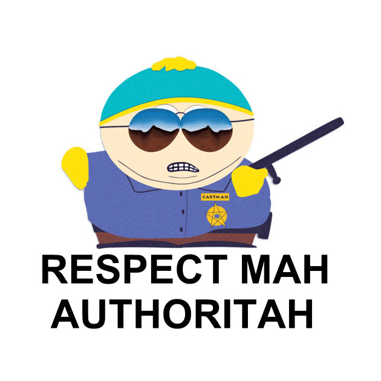

# Test NODE_EXTRA_CA_CERTS

## License

First things first: Most of the code is copied from [nodejs-self-signed-certificate-example by AJ ONeal](https://git.coolaj86.com/coolaj86/nodejs-self-signed-certificate-example). It's a great starter for anyone interested in how to create an own certificate authority and how to deal with OpenSSL.

## What's this

This repo will show you that the environment variable `NODE_EXTRA_CA_CERTS` actually works.

If you run `test.sh` it will create CA certificates and a signed certificate for localhost, then it starts an node.js HTTPS server and connects to it. All should happen without any warnings because we exported the certificate chain via the environment variable `NODE_EXTRA_CA_CERTS` 🔐